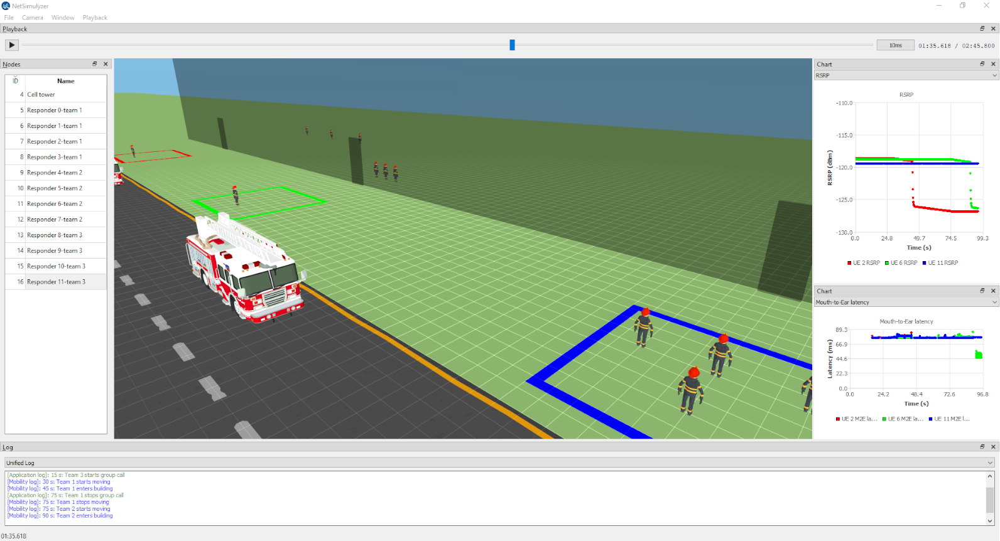

# NetSimulyzer ns-3 Module
A flexible 3D visualizer for displaying, debugging, presenting, and understanding *ns-3* scenarios.




# Table of Contents

* [About](#about)
* [Requirements](#requirements)
* [Installation](#installation)
    * [Clone (Recommended)](#clone-recommended)
    * [Download ZIP](#download-zip)
    * [Connecting the Module Quickly](#connecting-the-module-quickly)
    * [Connecting the Module Safely](#connecting-the-module-safely)
        * [Waf (Linking)](#waf-linking)
        * [Code](#code)
* [Updating](#updating)
    * [Clone](#clone)
    * [ZIP](#zip)

# About
This is the [ns-3](https://www.nsnam.org/) companion module the
[NetSimulyzer](https://github.com/usnistgov/NetSimulyzer).
Link this module & run your scenario to see it in 3D.

# Requirements
* A C++ 17 compliant compiler
    * Minimum supported compilers:
        * GCC 7.3.0
        * Clang 6.0.0

# Installation
## Clone (Recommended)
Clone the project into a directory called `netsimulyzer` in
the `src` folder of a supported version of ns-3

1) `cd` into the `src` folder of `ns-3`

```shell
cd src/
```

2) Clone the project from one of the below URLs
```shell
# Pick one of the below
# HTTPS (Choose this one if you're uncertain)
git clone https://github.com/usnistgov/NetSimulyzer-ns3-module netsimulyzer

# SSH
git clone git@github.com:usnistgov/NetSimulyzer-ns3-module.git netsimulyzer
```

3) (Re)configure & (Re)build `ns-3`
```shell
./waf configure
./waf
```

## Download ZIP
If, for whatever reason, `git` is not available. Just download the
project & unzip it into the `src` directory of `ns-3`.

Note that updates will have to be performed manually using this method

1) Download the ZIP of the project from the url below:

https://github.com/usnistgov/NetSimulyzer-ns3-module/archive/master.zip

2) Unzip the file into the `ns-3` `src/` directory
```shell
unzip NetSimulyzer-ns3-module-master.zip
```

3) Rename the resulting directory to `netsimulyzer`, as ns-3 will not accept a module named differently
than its directory.
```shell
mv NetSimulyzer-ns3-module-master netsimulyzer
```

## Connecting the Module Quickly
If you are linking your module/program to the `netsimulyzer` module add the following to your `wscript`

```python
# Program
obj = bld.create_ns3_program('program-name', ['netsimulyzer', '''...'''])


# Module
module = bld.create_ns3_module('module-name', ['netsimulyzer', '''...'''])
```

You may now include & use the `netsimulyzer` module in code:
```cpp
#include <ns3/netsimulyzer-module.h>
//...

int main ()
{
    // ...
    auto orchestrator = CreateObject<netsimulyzer::Orchestrator> ("example.json");
    // ...
}
```

## Connecting the Module Safely
You may wish for your module to not have a hard dependency on the `netsimulyzer` module.
The following steps will allow you to link the module & still allow your code to build &
run without 

### Waf (Linking)
If you wish for your module/program to be able to build without the `netsimulyzer` module
you may check for it's existence by reading `bld.env['HAS_NETSIMULYZER']` in your `wscript`. See below:

```python
def build(bld):
    # Create a list of your required modules to link
    # 'core' & 'mobility' are just examples here
    linked_modules = ['core', 'mobility']

    # Check if 'HAS_NETSIMULYZER' was defined during configuration
    if 'HAS_NETSIMULYZER' in bld.env:
        # If it was defined, then the 'netsimulyzer' is present and we may link it
        linked_modules.append('netsimulyzer')

    # Be sure to pass your list of `linked_modules` to `create_ns3_program`
    # or `create_ns3_module`
    obj = bld.create_ns3_program('application-name', linked_modules)
```

### Code
In addition to the variable in the build environment, the module also defines a C++ macro
also named `HAS_NETSIMULYZER`. This macro may be used in C++ code to check for the presence
of the `netsimulyzer` module.

See the below code sample:
```cpp
// Guard the include with the macro
#ifdef HAS_NETSIMULYZER
#include <ns3/netsimulyzer-module.h>
#endif

// ...

int main ()
{
    // ...

    // Guard any NetSimulyzer references in code with the macro as well
#ifdef HAS_NETSIMULYZER
    auto orchestrator = CreateObject<netsimulyzer::Orchestrator> ("example.json");
    // ...
#endif
}
```

## Updating
### Clone
To update the cloned module, move to the module's root directory and perform a `git pull`
```shell
# From the ns-3 root
cd src/netsimulyzer
git pull
```

### ZIP
TODO

